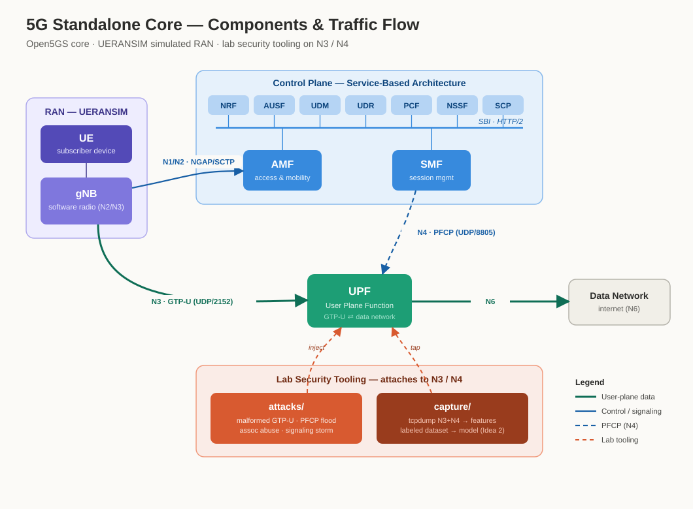

# 5G Core Lab-in-a-Box


A reproducible, infrastructure-as-code 5G Standalone (SA) core network you can stand up on a single host, drive with a simulated RAN, and attack with a curated set of red-team scripts. Built as a credibility artifact for 5G security advisory work and as the traffic-generation front-end for a downstream GTP/PFCP anomaly-detection model.

> **Scope & ethics.** Everything here targets a 5G core *you own and operate* inside this lab. The attack scripts generate malformed and high-volume N3/N4 traffic against `localhost`/lab addresses only. Do not point them at any network you are not authorized to test. See [`docs/THREAT-MODEL.md`](docs/THREAT-MODEL.md).

## Architecture at a glance



RAN (UE → gNB) into the Open5GS control plane, down to the UPF user plane, out to the data network — with the lab security tooling attaching at the N3 (GTP-U) and N4 (PFCP) interfaces. See [`docs/ARCHITECTURE.md`](docs/ARCHITECTURE.md) for the full component and data-flow view.

---

## Why this stack

| Concern | Choice | Rationale |
|---|---|---|
| 5G core | **Open5GS** (primary) | Mature C implementation, 4G+5G, Docker/K8s support, web UI for subscriber provisioning, largest community. Best reliability for a lab that must come up the same way every time. |
| 5G core (alt) | **free5GC** (profile) | Closer to the 3GPP SBA reference and strong in academic/research circles. Kept as a drop-in `deploy/free5gc` profile so the lab can demonstrate stack-agnostic tooling — a useful credibility signal in advisory contexts. |
| RAN + UE | **UERANSIM** | Software gNB + UE simulator that works with both cores. No SDR/hardware required. |
| Orchestration | **docker-compose** (host) → optional **Ansible/Terraform** | Compose for the fast inner loop; IaC layers for reproducing the host and, later, multi-node deploys. |

The lab defaults to Open5GS. free5GC is a supported alternate so the attack/capture tooling stays core-agnostic.

## Repository layout

```
5g-lab-in-a-box/
├── deploy/            # the core network + RAN, as code
│   ├── open5gs/       # primary profile (docker-compose + configs)
│   ├── free5gc/       # alternate profile (pointer + overrides)
│   └── ran/ueransim/  # gNB + UE simulator configs
├── infra/             # host provisioning
│   ├── ansible/       # host prep (kernel modules, docker, sysctl)
│   └── terraform/     # optional cloud/VM provisioning stubs
├── attacks/           # red-team scripts (lab-only)
│   ├── gtpu/          # N3: malformed GTP-U, tunnel floods
│   ├── pfcp/          # N4: session flood, association abuse
│   └── signaling/     # registration / auth storms
├── capture/           # N3/N4 packet capture + feature extraction
├── scripts/           # bootstrap / teardown / helpers
├── tests/             # smoke tests
└── docs/              # architecture, platform, roadmap, threat model
    └── diagrams/      # architecture SVG/PNG
```

## Prerequisites

Runs on a native **x86-64 Ubuntu 22.04/24.04** host (bare metal or a full Linux VM). It will **not** run on Docker Desktop for Mac/Windows — the Open5GS UPF needs the `gtp5g` Linux kernel module, which requires a real, modifiable kernel (≥ 5.4).

See **[`docs/PLATFORM.md`](docs/PLATFORM.md)** for the full appliance build: hardware sizing, OS prep, the `gtp5g` module, UERANSIM, configuration, and troubleshooting. `make bootstrap` automates the host prep once the OS is in place.

## Quick start

```bash
# 0. Prep the host (docker, kernel modules, sysctl). One-time. See docs/PLATFORM.md.
make bootstrap

# 1. Bring up the Open5GS core + WebUI
make up

# 2. Provision a test subscriber (IMSI/keys from .env)
make provision-subscriber

# 3. Start the simulated RAN (gNB then UE); UE should get an IP
make ran-up

# 4. Confirm end-to-end data path
make smoke-test

# 5. (later) Capture N3/N4 for the anomaly detector
make capture DURATION=300

# Tear everything down
make down
```

## Documentation

- [`docs/PLATFORM.md`](docs/PLATFORM.md) — prepare the Ubuntu appliance and run the lab, step by step.
- [`docs/ARCHITECTURE.md`](docs/ARCHITECTURE.md) — components, interfaces, and the capture → model data flow.
- [`docs/ROADMAP.md`](docs/ROADMAP.md) — milestones from empty host to a labeled dataset, including the handoff to **Idea 2 (GTP/PFCP anomaly detector)**.
- [`docs/THREAT-MODEL.md`](docs/THREAT-MODEL.md) — scope of use, attack classes, and why they map to real MNO risk.

## Status

This is a **scaffold**. Configs and scripts are runnable stubs with TODO markers where core-version-specific values (IMSI, keys, interface names, subnet) must be filled in. Work through `docs/ROADMAP.md` Phase 0 → 1 to reach a live end-to-end lab.

## License

MIT — see [`LICENSE`](LICENSE).
