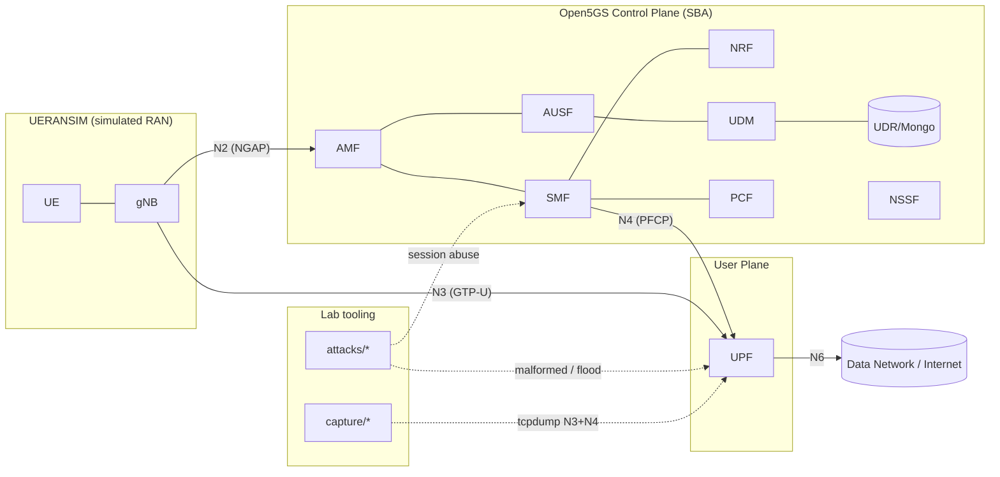
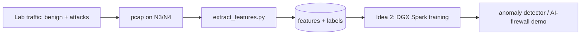

# Architecture

## Goal

A single-host 5G SA core that (a) reliably comes up from code, (b) carries real UE data traffic via a simulated RAN, and (c) exposes the N3 (GTP-U) and N4 (PFCP) interfaces to both attack tooling and packet capture. The capture output is the training/eval corpus for the downstream anomaly detector (Idea 2).

## Component view

Open5GS 5G SA control and user plane, driven by a UERANSIM gNB + UE, with attack and capture tooling attached to the N3/N4 segments.

## Interfaces we care about

| Interface | Protocol | Between | Why it matters here |
|---|---|---|---|
| **N3** | GTP-U (UDP/2152) | gNB ↔ UPF | User-plane tunnels. Target for malformed GTP-U headers, bad TEIDs, extension-header abuse, tunnel floods. |
| **N4** | PFCP (UDP/8805) | SMF ↔ UPF | Session management. Target for session-establishment floods, association abuse, heartbeat anomalies. |
| **N2** | NGAP/SCTP | gNB ↔ AMF | Signaling. Target for registration/auth storms. |
| N6 | IP | UPF ↔ DN | Egress; used to validate the data path in smoke tests. |

## Data flow (capture → Idea 2)

1. `capture/capture.sh` runs `tcpdump` on the docker bridge carrying N3+N4, filtered to UDP/2152 and UDP/8805, writing rotating pcaps.
2. `capture/extract_features.py` parses pcaps (scapy/pyshark) into per-flow / per-window feature rows: packet rate, byte rate, TEID churn, PFCP message-type distribution, malformed-header flags, inter-arrival stats, session-establishment rate.
3. Feature CSV/Parquet is the interface to **Idea 2**. Labels come from knowing which attack script (if any) was running during a capture window — the lab is a *labeled* data generator.

## IaC layering

- **Layer 0 — host prep** (`infra/ansible`): docker, kernel modules (`gtp5g` for Open5GS UPF), sysctl (ip_forward), NAT for N6. Makes any Ubuntu host reproducible.
- **Layer 1 — the lab** (`deploy/`): docker-compose brings up the core, WebUI, and RAN. This is the everyday inner loop.
- **Layer 2 — provisioning** (`infra/terraform`, optional): stand up the host itself (cloud VM or libvirt) so the whole lab is reproducible from nothing. Stubbed for now.

## Design decisions worth documenting for advisory work

- **Everything is code and version-controlled** — no hand-clicked config. This is the point of the artifact.
- **Core-agnostic tooling** — attack/capture scripts speak GTP-U/PFCP, not Open5GS internals, so they also run against free5GC and (in principle) commercial cores.
- **Labeled-by-construction dataset** — because the lab knows what attack (if any) is running, every capture window is cleanly labeled, which is exactly what the detector needs and what public datasets usually lack.
