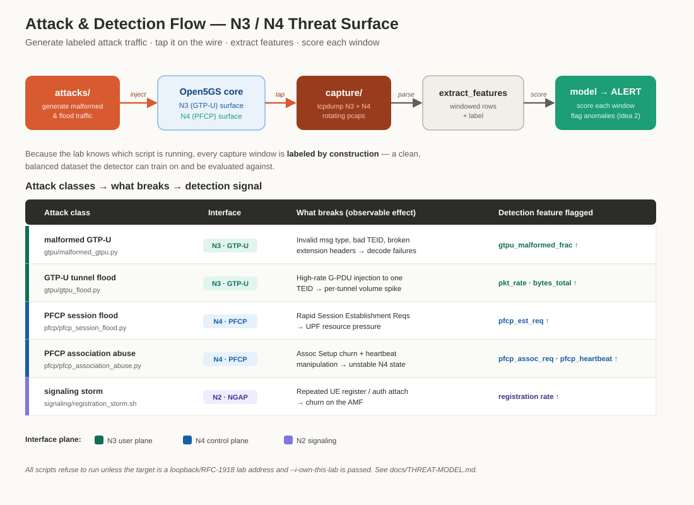

# Threat model & scope of use

## Authorized use only

Every script in `attacks/` is written to target the **local lab core you control**. Default targets are `127.0.0.1` / the lab's docker subnet. Do not repoint them at production, a carrier network, or any system you are not explicitly authorized to test. Unauthorized interference with telecom infrastructure is illegal in most jurisdictions.

## Attack & detection flow

Each attack script generates labeled traffic against a target interface; the capture tool taps it, features are extracted per window, and the model scores each window. Because the lab knows which script is running, every window is labeled by construction.

## What we model

The lab reproduces adversary techniques against the two data-plane/signaling interfaces most exposed in a real deployment when perimeter assumptions fail (rogue gNB, compromised transport, malicious peer):

| Class | Interface | Technique | What a defender should detect |
|---|---|---|---|
| Malformed GTP-U | N3 (UDP/2152) | Invalid message type, reserved bits set, bogus/rotating TEID, oversized or malformed extension headers | Header-validity anomalies, TEID that maps to no session, decode failures |
| GTP-U tunnel flood | N3 | High-rate G-PDU injection to a TEID | Packet/byte-rate spikes per TEID, tunnel churn |
| PFCP session flood | N4 (UDP/8805) | Rapid Session Establishment Requests | Session-establishment rate spike, resource exhaustion on UPF |
| PFCP association abuse | N4 | Repeated/forged Association Setup, heartbeat manipulation | Association churn, heartbeat interval anomalies |
| Signaling storm | N2 (NGAP) | Repeated registration/auth attach | Registration rate spike, auth-failure ratio |

## Why these map to real risk

N3/N4 are frequently carried over transport that operators treat as trusted. GTP has a long history of abuse (GTP-in-GTP, TEID guessing, spoofed peers), and PFCP is comparatively new and under-monitored. A detector that flags these classes on captured N3/N4 is a concrete, demonstrable control — which is the point of pairing this lab with Idea 2.

## Data handling

Captured pcaps contain only synthetic UE traffic generated in the lab. No real subscriber data is involved. Still, treat pcaps as lab artifacts: keep them out of version control (see `.gitignore`).
